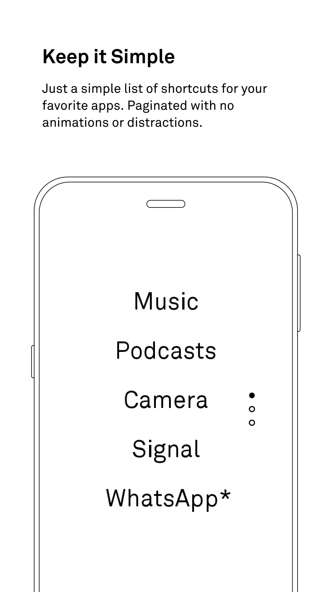
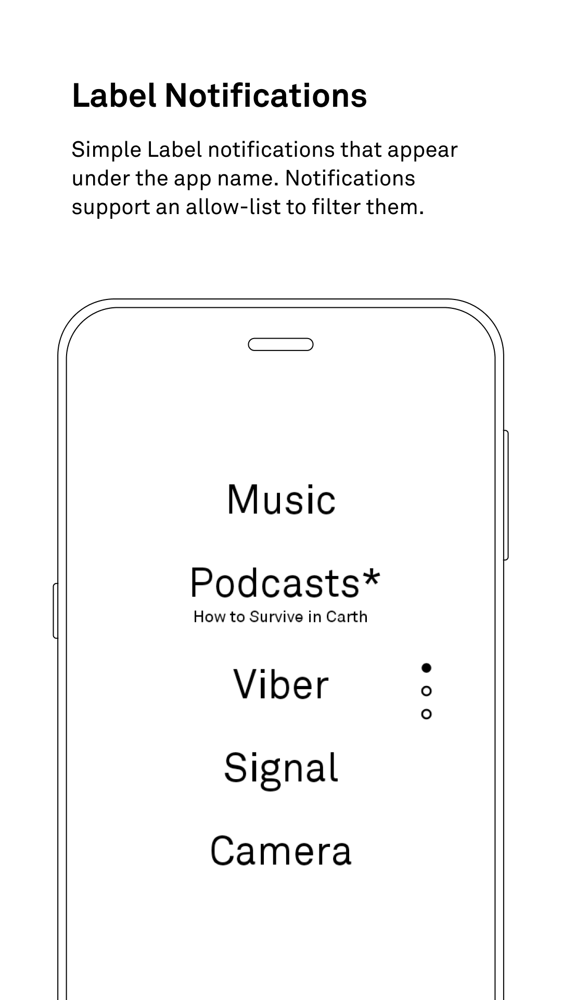
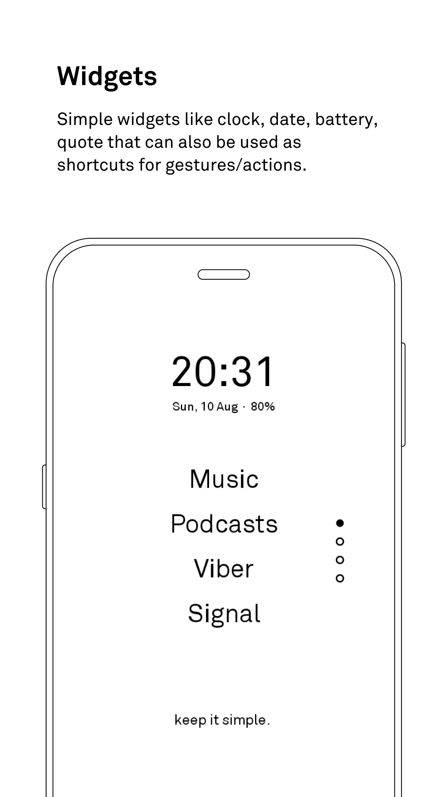
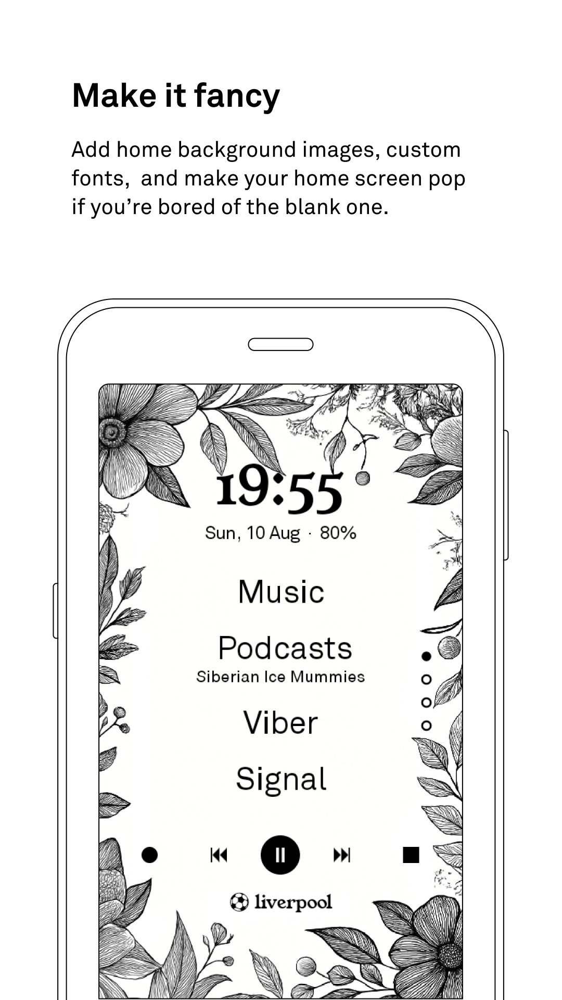
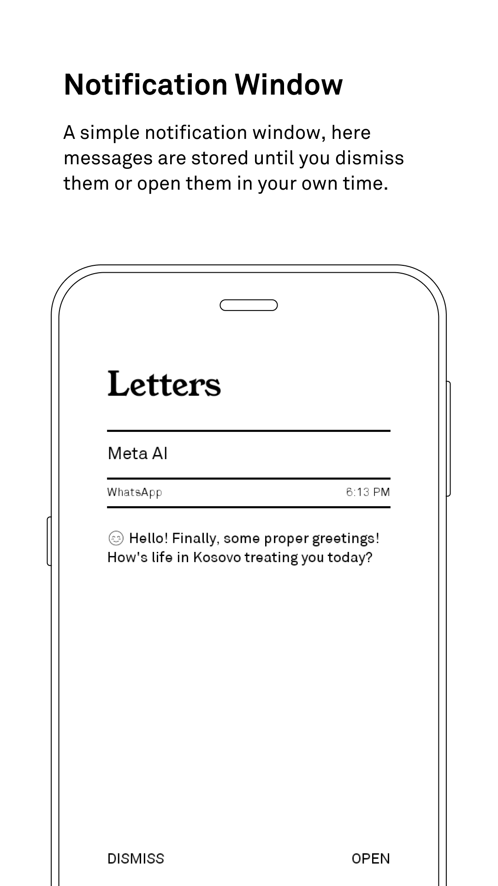
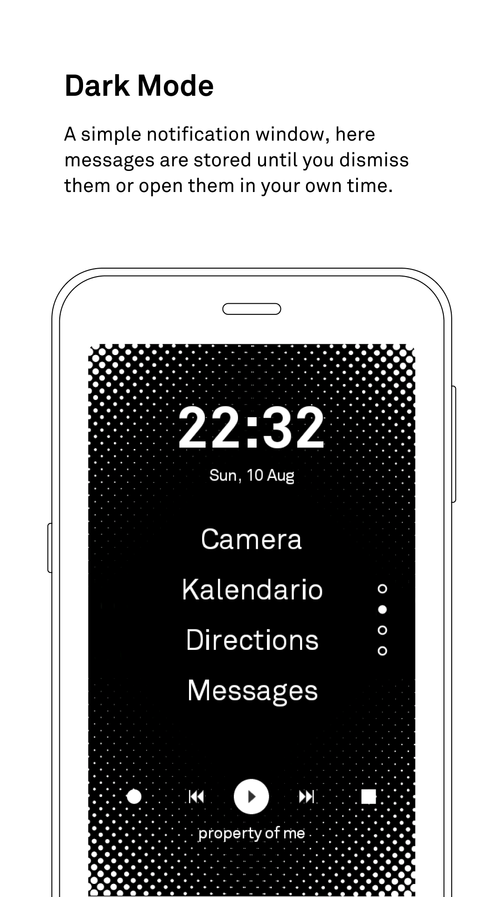
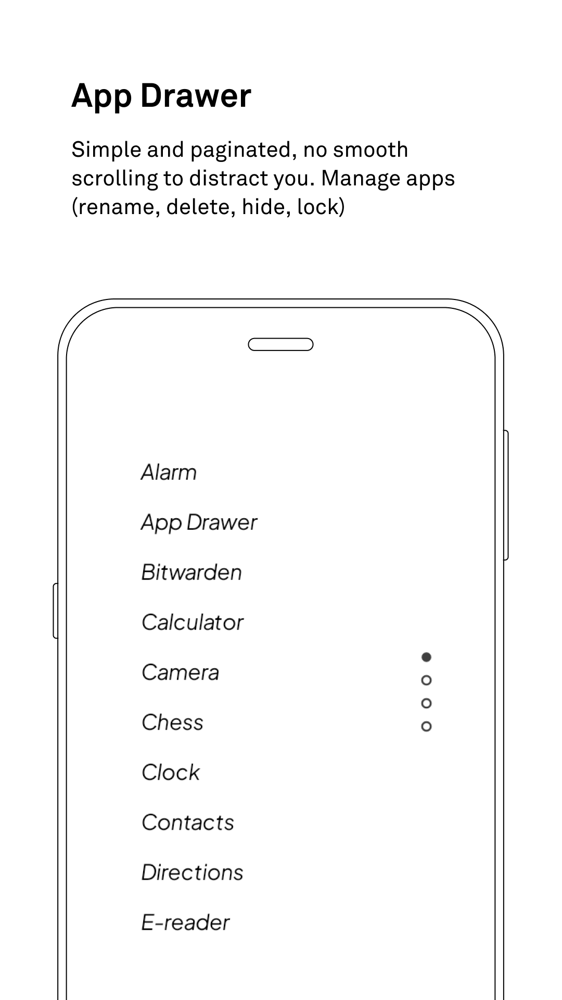
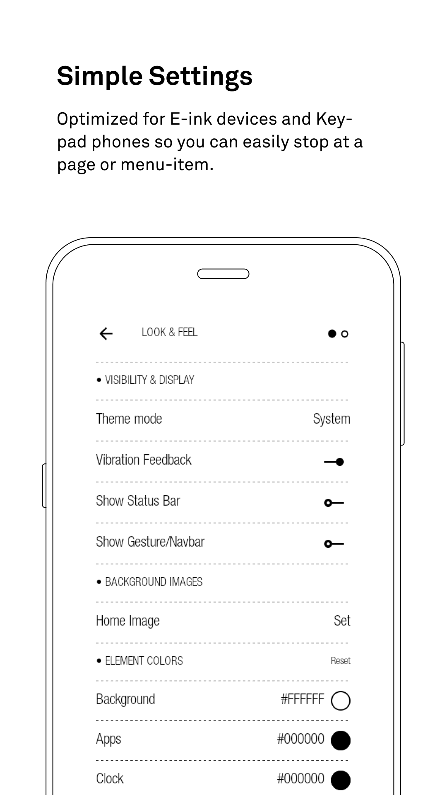

	
	<h2>inkOS - Text based & E-ink friendly Android Launcher </h2>
    <table>
        <tr>
            <td></td>
            <td></td>
            <td></td>
            <td></td>
        </tr>
        <tr>
            <td></td>
            <td></td>
            <td></td>
            <td></td>
        </tr>
    </table>

[Documentation](DOCUMENTATION.md) | [Video demo](https://www.youtube.com/watch?v=dAmHJ5aFLWA)

# Tested on Android 10 to 16.

It works well with these minimal/dumbphone devices:

- Mudita Kompakt
- LightPhone 3 (tested on emulator)
- QIN F22
- Cat S22 flip

# Downloading

You can download the apk directly on the Release section on the rightside of github, or you can use a manager like IzzyOnDroid. It might come on F-Droid in the future once I figure it out.

# Forked with extra features

### Features

**Home Screen**
- Multi-page home screen support.
- 9 clock styles: Default, Flip, Boxed, Round, Split, Horizontal, Box Outline, Analog, Stacked.
- Dual clocks with configurable timezone offset.
- Per-element alignment: clock, date, apps, and quote each align independently (left/center/right).
- 7 bottom widget types: Quote, Calendar Events, Android Widget, Shortcuts, Total Usage, Page Dots, or Disabled.
- Audio widget: appears on playback, persists when paused, dismissible.
- Embed any native Android widget with adjustable height and margins.
- Separators (empty space, em dash, dots) for visual grouping.
- Edit Mode: tap any element to open its settings live on screen.

**App Drawer**
- A-Z sidebar for quick alphabetical navigation.
- Sort by A-Z, most used, or last used.
- Multi-source search: apps, contacts, web, device settings, music, and files.
- Auto-launch single search results. Auto-show keyboard option.
- Long-press menu: uninstall, rename, hide, lock, app info.
- Hide apps already on the home screen from the drawer.
- App shortcuts and pinned shortcuts from third-party apps.

**Fonts & Typography**
- Per-element font: clock, date, apps, quote, notifications, settings each get their own font family and size.
- Universal font mode: set one font for everything, then customize individual elements.
- Custom .ttf/.otf files from device storage.
- App name modes: normal, lowercase, UPPERCASE.

**Themes & Look**
- 15 one-tap theme presets. Custom text and background colors for light and dark mode.
- Light, Dark, and System theme modes with independent light/dark color settings.
- Wallpaper support with background opacity slider.
- 4 icon modes: Text letters, System adaptive, System tinted (monochrome), Icon Packs.
- Icon shapes: pill, rounded, square.
- Text islands: pill-shaped backgrounds behind text elements, with color inversion.
- Theme export/import (JSON).

**Gestures**
- 4 swipe directions + double tap + clock/date/quote tap, each assignable to 15+ actions.
- Actions: open app, drawer, notifications, recents, simple tray, hub, settings, e-ink refresh, brightness toggle, lock screen, quick settings, power dialog, restart, exit inkOS, toggle private space, toggle work profile.
- Configurable short/long swipe sensitivity thresholds.
- Edge swipe back gesture.
- Volume keys for page navigation (essential for E-ink/keypad devices).

**Notifications**
- Notification badges (*) next to app names with pending notifications.
- Label notifications: actual message content below app names.
- Media playing indicator with track name display.
- Letters: full-screen notification reader with vertical paging and keyboard/DPAD shortcuts.
- Simple Tray: paginated notification tray with per-page density and bottom navigation.
- Hub: device status dashboard (battery, WiFi, Bluetooth, storage, brightness, DND).
- Three independent per-app allowlists (home badges, letters, simple tray).
- Chat options: toggle sender name, group name, message preview independently.

**Recents**
- Recent apps and usage statistics with time/money/coffee display modes.
- Filter by today, this week, this month, or all time.

**E-Ink & Hardware**
- Auto screen refresh after exiting apps (configurable delay, home-only option).
- 4 E-ink display modes: Disabled, Contrast, Clear, Reading (Mudita Kompakt).
- T9, D-pad, and QWERTY keyboard navigation support.
- UI scale modes: Auto, Tiny, Small, Medium, Normal, Big, Large, Extra Large.

**Advanced**
- Backup/restore all settings. Theme-only export/import.
- Show/hide status bar and navigation bar independently.
- Haptic feedback toggle.

## Permissions

> [!NOTE]
> inkOS does not request internet access and does not collect or transmit any data.

| Permission | Why |
|---|---|
| `QUERY_ALL_PACKAGES` | List all installed apps |
| `REQUEST_DELETE_PACKAGES` | Uninstall apps (requires user confirmation) |
| `EXPAND_STATUS_BAR` | Expand/collapse status bar via gestures |
| `VIBRATE` | Haptic feedback |
| `SET_WALLPAPER` | Set wallpapers |
| `USE_BIOMETRIC` | PIN/fingerprint lock for apps and settings |
| `WRITE_SETTINGS` | Brightness control (Simple Tray) |
| `CAMERA` | Flashlight toggle (Simple Tray) |
| `READ_PHONE_STATE` | Cellular signal display (Simple Tray) |
| `MODIFY_AUDIO_SETTINGS` | Volume control (Simple Tray) |
| `ACCESS_WIFI_STATE` | WiFi status (Simple Tray) |
| `CHANGE_WIFI_STATE` | WiFi toggle (Simple Tray) |
| `BLUETOOTH` | Bluetooth status (Hub, API 30 and below) |
| `BLUETOOTH_ADMIN` | Bluetooth admin (Hub, API 30 and below) |
| `BLUETOOTH_CONNECT` | Bluetooth device info (Hub) |
| `PACKAGE_USAGE_STATS` | Recent/most-used apps (Recents screen) |
| `READ_CONTACTS` | Contact search in app drawer |
| `READ_CALENDAR` | Calendar events widget |
| `READ_MEDIA_IMAGES` | Wallpaper selection |
| `READ_MEDIA_AUDIO` | Music search in app drawer |
| `READ_EXTERNAL_STORAGE` | Media access (Android 12 and below) |
| `BIND_APPWIDGET` | Embed Android widgets on home screen |
| `INSTALL_SHORTCUT` | Legacy shortcut pinning |
| `ACCESS_HIDDEN_PROFILES` | Android 15+ Private Space |

## Built With

| Component | Details |
|---|---|
| **Language** | Kotlin 2.1.20 |
| **UI** | Jetpack Compose 1.10.4, Material3 1.4.0 |
| **Build** | AGP 8.10.1 |
| **Target SDK** | API 26 - 36 (Android 8.0 - 16) |

## License

inkOS is open source under the GPLv3 license, giving you the freedom to use, study, modify, and
distribute it. The Copyleft provision ensures these freedoms remain intact, so inkOS will always be
fully open source and customizable by anyone.

## Credits

Originally forked from [mLauncher](https://github.com/DroidWorksStudio/mLauncher), itself a fork of [Olauncher](https://github.com/tanujnotes/Olauncher). At this point inkOS is pretty much its own thing.

## Support the project

<table><tr>
<td></td>
<td valign="middle">inkOS is free, open source, and ad-free forever. If it's made your phone better, consider supporting development.</td>
</tr></table>
